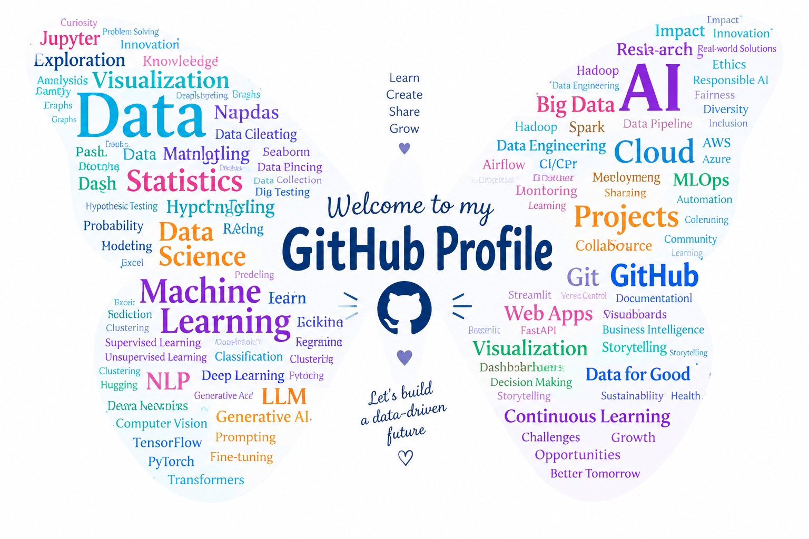

# Bonjour, je suis Fatima Ezzahrae 👋

### Data Scientist · Statisticienne 

  

Je suis Data Scientist – Statisticienne, avec un parcours orienté vers les
statistiques appliquées, l'analyse de données et la modélisation.

Mon parcours en recherche m'a amenée à travailler sur des problématiques
concrètes et à mobiliser les données pour mieux comprendre les phénomènes
étudiés. Au fil de mes expériences, j'ai développé un intérêt particulier
pour l'analyse et l'interprétation des données.

Ce qui m'intéresse particulièrement est de partir d'une question, explorer
les données, choisir les méthodes adaptées et transformer les résultats en
une analyse claire et interprétable.

J'aime cette démarche qui consiste à utiliser la donnée pour mieux comprendre
une problématique réelle et produire des résultats utiles à la réflexion
et à la décision.

 

---

## Ce qui m'intéresse

- **Analyse de données & statistiques appliquées**
- **Data Science, Machine Learning & modélisation**
- **Intelligence artificielle & Deep Learning**
- **Visualisation et restitution des résultats pour l'aide à la décision**
- **Applications de la data et de l'IA à des problématiques réelles**  
  *(santé, marketing, politiques publiques, etc.)*
---

##  Outils & technologies

###  Bases de données

  
  

**SQL · MongoDB**
### 📊 Data & Statistiques

  
  
  
  
  

**Python · Pandas · NumPy · R**

### 🤖 Machine Learning & IA

  
  
  
  

**Scikit-learn · TensorFlow · PyTorch · Hugging Face**

### 📈 Visualisation & analyse spatiale

**Matplotlib · Seaborn · GeoPandas**

### 💻 Environnement & collaboration

  
  
  
  
  
  

**Jupyter · Git · GitHub · VS Code · Google Colab · Docker (notions)**

---

##  Ma façon de travailler avec les données

**Comprendre → Explorer → Analyser → Interpréter → Communiquer**

Je commence par comprendre la problématique et les données disponibles.
J'explore ensuite leur structure et leur qualité avant de choisir les
méthodes statistiques ou de Data Science adaptées.

L'objectif n'est pas seulement de produire des résultats, mais aussi de
les interpréter et de les restituer de manière claire afin qu'ils puissent
répondre à la question de départ.

---

## 📄 Publications

**Stability and Reproducibility of the NeoMundi ControlTower Runtime Signal**

Note exploratoire de réplication sur la stabilité et la reproductibilité du
signal runtime NeoMundi ControlTower — 680 générations analysées sur
3 fournisseurs de modèles. *Versions française et anglaise disponibles.*

NeoMundi Research Observatory, 2026.

**Actionability of the NeoMundi ControlTower Runtime Signal**

Note technique évaluant l'actionnabilité du signal de gouvernance runtime
(capacité à déclencher une intervention avant la fin de la génération).
*Versions française et anglaise disponibles.*

NeoMundi Research Observatory, 2026.

---

## 📂 Mes projets

Vous trouverez sur ce profil différents projets autour de l'analyse de
données, des statistiques appliquées et de la Data Science.

Chaque projet présente la problématique étudiée, les données utilisées,
la méthodologie, les résultats obtenus ainsi que leur interprétation.

---

## 📫 Me contacter

  
  &nbsp;
  

